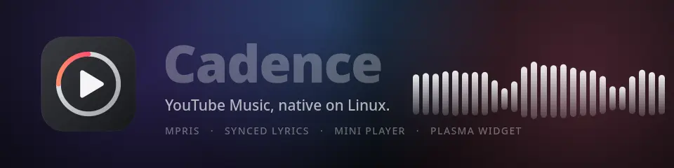
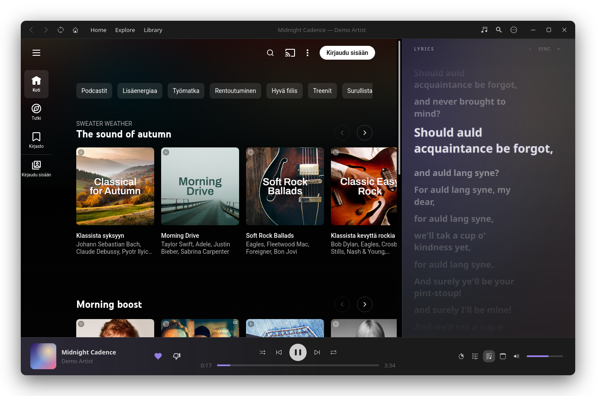
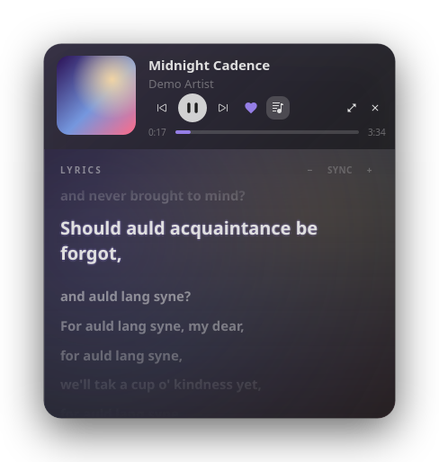
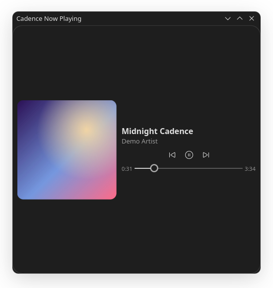
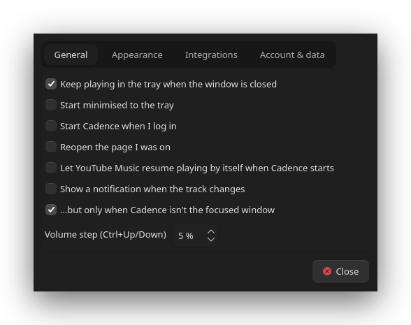

<p align="center">
  
</p>

<p align="center">
  <a href="LICENSE"></a>
  
  
  
</p>

<p align="center">
  <b>A native-feeling YouTube Music player for Linux.</b><br>
  Your account, library and recommendations, with a real desktop shell around them:<br>
  MPRIS, a tray icon, synced lyrics, a mini player and a Plasma widget.
</p>

<p align="center">
  
</p>

---

## Why

YouTube Music already has everything: your library, playlists, uploads, podcasts and the recommendations.
What it lacks on Linux is a proper desktop citizen. Cadence keeps the real web player for playback and the
account, and replaces everything around it with native Qt: the title bar, the player bar, media keys,
notifications, lyrics, a mini player and widgets.

No audio is ripped or re-encoded, and there are no `yt-dlp` or unofficial API tokens to keep alive. Playback
is the stock player, so it keeps working the way your browser does.

## Features

| | |
|---|---|
| **Native player bar** | Cover art, seek bar, shuffle / repeat / like / volume and queue, tinted with the album colour. YouTube Music's own bar is hidden, so there is only one timeline. |
| **Synced lyrics** | Spring-animated lyrics from [LRCLIB](https://lrclib.net) with a karaoke-style sweep, blurred cover backdrop, click-to-seek and a per-song sync nudge. |
| **Mini player** | A small always-on-top window (pinned through KWin, since Wayland ignores stay-on-top hints) with the same lyrics view. |
| **MPRIS2** | Plasma's media widget, lock screen, KDE Connect, `playerctl`, hardware media keys and Stream Deck software all just work. |
| **Tray and notifications** | Close to the tray, middle-click to play or pause, track-change notifications with cover art. |
| **Plasma widget** | `Cadence Now Playing`: cover, title, controls and a seek bar for your desktop or panel. |
| **Custom title bar** | One slim frameless row with navigation, now playing and window controls, rounded corners, compositor-driven move and resize. |
| **Scriptable** | `cadence ctl ...` over D-Bus, plus a `now-playing.json` and `cover.jpg` for eww, conky and friends. |
| **Sleep timer** | 15 to 90 minutes or "end of this track", with a fade-out. |
| **ListenBrainz** | Optional scrobbling with your user token. |

<table>
  <tr>
    <td align="center" valign="top"><br><sub>Mini player with lyrics</sub></td>
    <td align="center" valign="top"><br><sub>Plasma widget</sub></td>
    <td align="center" valign="top"><br><sub>Settings</sub></td>
  </tr>
</table>

## Install

Grab a package from the [latest release](https://github.com/ProfetGit/cadence/releases/latest), or build from source.

| Format | How | Notes |
|---|---|---|
| **Flatpak** | `flatpak install --user io.github.ProfetGit.Cadence.flatpak` | Sandboxed, ~100 MB. Pulls the KDE 6.11 runtime from Flathub if you don't have it. Run with `flatpak run io.github.ProfetGit.Cadence`; the CLI is `flatpak run io.github.ProfetGit.Cadence ctl ...`. |
| **Arch / CachyOS / Manjaro** | `sudo pacman -U cadence-music-*-any.pkg.tar.zst` | Or build the [`PKGBUILD`](packaging/arch/PKGBUILD) yourself. Installs the `cadence-music` command (see the note below). |
| **Debian / Ubuntu** | `sudo apt install ./cadence-music_*_all.deb` | Pure Python package. **Untested** on Debian and Ubuntu: it was only built here, not installed. |
| **pip / pipx** | `pipx install --system-site-packages cadence_music-*.whl` | Needs PyGObject from your distribution (`python3-gi`) so `pip` doesn't have to compile it. |
| **Source tarball** | `tar xf cadence-*.tar.gz && cd cadence-* && ./install.sh` | Installs under `~/.local` only; no root. `./install.sh --uninstall` removes it. |

Every file has a checksum in `SHA256SUMS`.

Not provided: **AppImage** (bundling Python, Qt and QtWebEngine would be a 300 MB+ image that I could not
verify), **RPM** and **Snap**. Pull requests are welcome.

> **The command name.** The app is called Cadence and the command is `cadence`, but Arch already ships an unrelated
> `cadence` (the KXStudio JACK toolbox) at `/usr/bin/cadence`. The distro packages therefore install
> `cadence-music` instead. `install.sh` and the Flatpak keep `cadence`. Everywhere below, read `cadence` as
> whichever your install provides.

### From source

Requirements: Python 3.10+, Qt 6 with WebEngine, PyGObject (for D-Bus). KDE Plasma 6 on Wayland is what Cadence
is developed and tested on; the KWin pin and the Plasma widget are Plasma specific, everything else is plain Qt
and D-Bus.

```bash
# Arch / CachyOS / Manjaro
sudo pacman -S python-pyqt6 python-pyqt6-webengine python-gobject

git clone https://github.com/ProfetGit/cadence.git
cd cadence
./install.sh
```

Other distributions: install the equivalents (`PyQt6`, `PyQt6-WebEngine`, `PyGObject`) from your package manager
or `pip`, then run `./install.sh`. It only writes under `~/.local` (launcher, desktop entry, icon and the
Plasma widget) and never needs root.

Start it from your application menu, or run `cadence`. Sign in with your Google account from YouTube Music's
own account button the first time.

## Usage

### Keyboard

| Key | Action |
|---|---|
| `Ctrl+L` | Focus search |
| `Ctrl+M` | Mini player |
| `Ctrl+Shift+L` | Lyrics panel |
| `Ctrl+←` / `Ctrl+→` | Previous / next track |
| `Ctrl+↑` / `Ctrl+↓` | Volume up / down |
| `Alt+←` / `Alt+→` | Back / forward |
| `F11` | Full screen |
| `Ctrl+,` | Settings |

### Command line

```bash
cadence ctl toggle                 # play / pause
cadence ctl next
cadence ctl volume +5              # or: volume 40
cadence ctl seek -10
cadence ctl sleep 30               # also: sleep track, sleep off
cadence ctl status --format '{artist} - {title}'
cadence "https://music.youtube.com/watch?v=..."   # open a link in the running app
```

`cadence ctl --help` lists every command. Bind them to global shortcuts in *System Settings → Shortcuts*.

### For widgets and bars

Cadence writes the current state to `$XDG_RUNTIME_DIR/cadence/now-playing.json` and the current cover to
`cover.jpg` in the same folder. Anything that can read a file, such as eww, conky, a Quickshell bar or a
Plasma command widget, can show it. `position` is the value at `updated`; add the elapsed time while
`status` is `Playing`.

## Lyrics sync

LRCLIB timestamps are community made, so a few songs are slightly early or late. Hover the lyrics header and use
`−` / `+` to shift the current song by 0.1 s; the value is remembered per track in
`~/.config/cadence/lyrics_offsets.json`. Click the value to reset it.

## Files

| Path | Contents |
|---|---|
| `~/.config/cadence/settings.json` | Settings (private, mode 0600) |
| `~/.local/share/cadence/webengine/` | The embedded browser profile and your sign-in |
| `~/.cache/cadence/` | Cover art, lyrics cache and `cadence.log` |

## Development

```bash
python3 tests/smoke.py        # headless: settings, player model, JS bridge against a fake page, scrobbling, sleep timer
python3 tests/test_mpris.py   # MPRIS service over the session bus
```

`packaging/build-all.sh` builds every release artifact into `dist/` (tarball, wheel, Arch package, `.deb`, Flatpak
bundle), `tools/make_banner.py` renders the animated banner (a seamless 3 s loop at exactly 60 fps) and
`tools/screenshots.py` renders the screenshots above from the real UI with synthetic demo state, so no account
or audio is involved. Set `CADENCE_HOME` to a throwaway folder to run a development instance with its own
profile, and `--debug` to enable the `Eval` / `Screenshot` D-Bus calls.

### How it works

- A QtWebEngine page hosts `music.youtube.com`. An injected script (`cadence/js/bridge.js`) reads the player
  through `navigator.mediaSession`, the `<video>` element and the player controls, and reports to Python over
  QWebChannel. The only slot the page can call is `report()`, which parses JSON defensively.
- Commands travel the other way as fixed-name calls. Both the classic player bar and the newer mini player layout
  are supported.
- MPRIS and the control service are plain GDBus objects (`cadence/gdbus.py`), which run on Qt's GLib event loop
  without any extra plumbing.
- Google refuses sign-in from embedded Chromium, so on `accounts.google.com` only, Cadence presents a consistent
  Firefox identity (headers and JavaScript). Everything else sees normal Chromium. See `cadence/auth.py`.

## Limitations

- Unofficial. If Google changes the sign-in flow or the YouTube Music page, parts of the bridge or the sign-in
  workaround may need updating. A "bridge not connected" banner appears when the page can no longer be read.
- Developed on KDE Plasma 6 / Wayland. Other desktops should work for playback, MPRIS and the tray, but are untested.
- No downloads, offline mode or ad blocking, on purpose. Free accounts still get YouTube's ads.
- Lyrics come from LRCLIB; the track title, artist and length are sent there when the lyrics panel is open.
  Turn it off in Settings if you prefer.

## Disclaimer

Cadence is an independent project. It is not affiliated with, endorsed by or sponsored by Google or YouTube.
YouTube and YouTube Music are trademarks of Google LLC. You need your own account, and you are responsible for
following YouTube's terms of service.

## License

[MIT](LICENSE)
